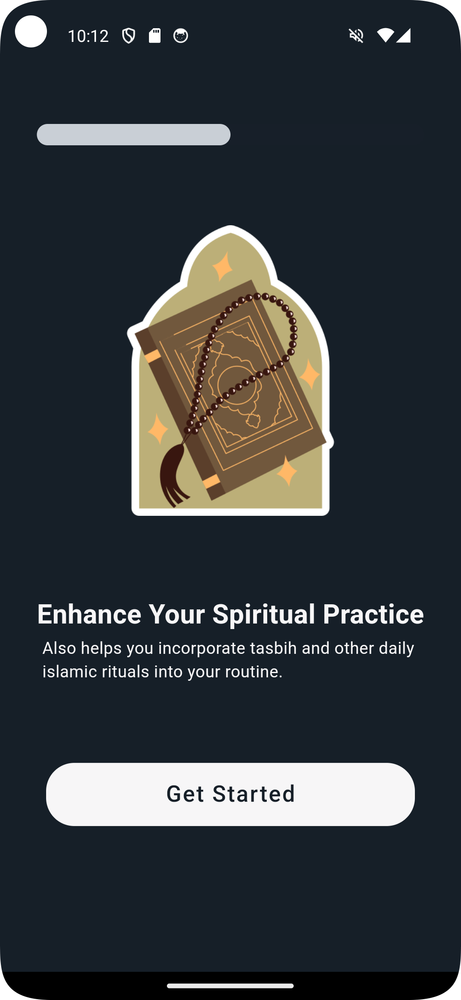

# Salat Tracker App

A beautiful and intuitive Salat Tracker app built with Flutter, using GetX for state management and Firebase for authentication. This app allows users to track their Salat (prayer) times and offers both dark mode and light mode themes for a comfortable user experience.

## Features

- **User Authentication:** Secure sign-up and login using Firebase Authentication.
- **Salat Tracking:** Track daily Salat times effortlessly.
- **Dark and Light Mode:** Switch between dark mode and light mode for a personalized experience.
- **API Integration:** Fetch data seamlessly from external APIs for accurate prayer timings.

## Screenshots

### Dark Mode Screenshots

|  |  |  |  |
|-------------------|-------------------|-------------------|-------------------|
|  |  |  |  |

### Light Mode Screenshots

|  |  |  |  |
|-------------------|-------------------|-------------------|-------------------|
|  |  |  |  |